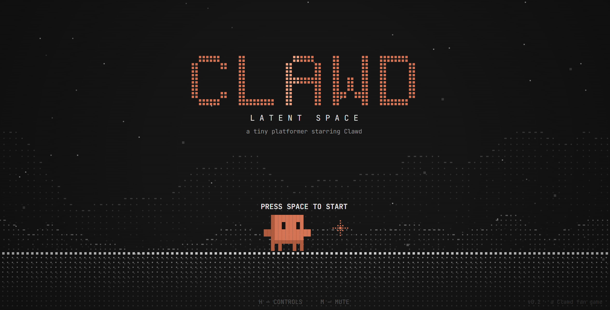

# CLAWD — Latent Space



A 2D game starring Clawd. **World 1** is an Astro Bot style platformer. At its end Clawd finds the
**Token Blaster**, and **World 2** turns into a shooter: aim with the mouse, fire tokens, and buy better
weapons and upgrades in the shop. The final boss of World 2 is **Codex**.

The look is "dot-matrix": terrain, mountains and enemies are built from dots and ASCII characters, and only
Clawd and the things that matter are bright orange. Everything runs locally in the browser: no CDN, no external
fonts and no audio files (all sound is synthesized with WebAudio).

## Getting started

```bash
npm install
npm run dev        # http://localhost:5173
npm test           # unit tests + a completability check for every level
npm run build      # production build into dist/
```

## Controls

| Input | Action |
|---|---|
| ← → / A D | Move |
| Space / K | Jump (hold longer to jump higher) |
| Hold jump in the air | Hover (the jet hurts enemies) |
| X / J | World 1: spin · World 2: shoot |
| C / L / right mouse button | Spin |
| ↓ + spin in the air | Ground pound (breaks purple "corrupted" blocks) |
| ↓ + Space | Drop through a platform |
| Mouse + left button | World 2: aim and shoot |
| ↑ / ↓ + X | Aim without a mouse (8 directions) |
| 1–5 · Q E · mouse wheel | Switch weapon |
| B (on the map) | Shop |
| Esc / P · M · H | Pause · mute · controls |
| F1 / F2 | Debug overlay / noclip (in debug mode) |

Gamepad: A jump, X shoot, B spin, right stick aims, LB/RB/Y switch weapons, Start pauses.

## Content

**World 1 — Latent Space** (platformer)
- 1-1 Token Plains, 1-2 Gradient Caves, 1-3 Context Window
- 1-B The Hallucination: drops the Token Blaster when defeated, unlocking World 2 and the shop

**World 2 — Benchmark Wars** (shooter)
- 2-1 Merge Conflict Mesa: turrets, drones, shield bots
- 2-2 GPU Forge: hot vents, ceiling turrets, 429 crushers, moving platforms
- 2-3 Prompt Injection Swamp: injectors (they split into bugs when destroyed), islands
- 2-4 The Diff Towers: a vertical climb under fire
- 2-B Codex: a monitor with two giant cursor hands, autocomplete walls, `{ }` volleys,
  "npm test" bugs and `rm -rf` beams, in 3 phases

**Weapons** (Context = heat; when it overflows the weapon has to cool down)

| Weapon | Price | Notes |
|---|---|---|
| Token Blaster | found | reliable, medium fire rate |
| Context Spreader | 120 tokens | 5 tokens at once, short range |
| Stream Output | 220 tokens + 3 sparks | very fast stream of characters |
| Attention Beam | 380 tokens + 8 sparks | a beam that pierces every enemy in line |
| Opus Cannon | 520 tokens + 12 sparks | explosive orb, breaks corrupted blocks |

**Upgrades**: Extra Heart, Bigger Model (damage), Faster Inference (fire rate), Longer Context,
Jet Tuning (hover), Token Magnet.

Tokens collected in a level are added to your wallet when you finish it. Sparks are spent in the shop but
still count as found on the map. Progress is saved to `localStorage`.

## Project layout

- `src/config.ts`: movement constants (the game "feel")
- `src/weapons.ts`: weapons and upgrades (prices, damage, fire rate, heat)
- `src/entities/player.ts`: Clawd's physics and states
- `src/entities/gun.ts`, `bullets.ts`: shooting, bullets, heat
- `src/entities/enemies.ts`, `enemies2.ts`: World 1 / World 2 enemies
- `src/entities/boss/`: The Hallucination and Codex
- `src/world/levels/*.ts`: levels as ASCII maps (each file starts with a legend)
- `src/scenes/`: title, world map, game, shop, results
- `tests/reachability.test.ts`: plays through every level with Clawd's real physics and checks that the exit,
  every spark and every sub-agent can be reached. After editing a map, just run `npm test`.

## Dev shortcuts (only with `npm run dev`)

- `?map` / `?shop` open the map / shop, `?rich` fills the wallet (2000 tokens, 30 sparks)
- `?level=4` starts a level by index (0–8), `?level=4&tx=120&ty=16` moves Clawd to a tile
- `?ff=300&hold=KeyD,KeyX` simulates N ticks with keys held (useful for headless screenshots)
